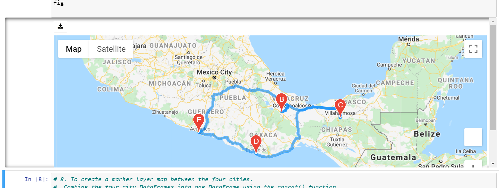
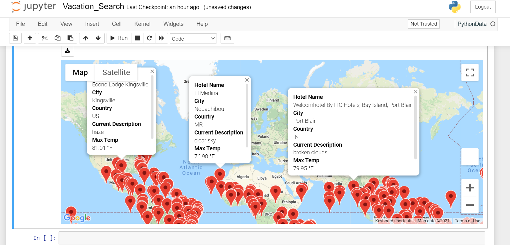

# World_Weather_Analysis
OSU Module 6 WeatherPy with Python APIs
## The purpose of this module was to work with Python and API's to gather relevant data about weather in order to inform a travel itinerary.
 - First we used Python's Random module to create thousands of pairs of geographic coordinates (latitudes and longitudes).
 - Next, we used the citipy module to find the closest corresponding cities to the generated 'locations'.
 - Then we used the unique city results to create a database including lat, long, city and country and current weather conditions.

## The second section made use of google maps apis to generate maps and visualizations for our trip.

